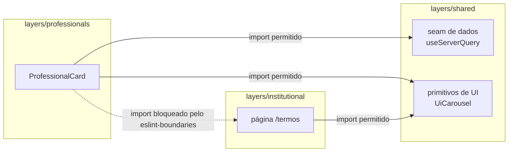

# onluxe

Catálogo de profissionais autônomos construído para o [Atlas Frontend Challenge](https://github.com/atlastechnol/atlas-frontend-challenge). Listagem com busca, filtros, ordenação e scroll infinito, além de página de perfil detalhada — tudo com dados mockados (sem backend real).

> Conteúdo do domínio (adulto/acompanhantes) é fictício, gerado via Faker com seed fixa. As fotos padrão são um conjunto próprio de pessoas sintéticas (geradas por IA, versionadas no repositório) — dá pra trocar para imagens via Picsum através de uma variável de ambiente, útil só pra testar volume/variedade localmente.

---

## Stack

- **[Nuxt 4](https://nuxt.com/)** + TypeScript
- **[NuxtUI 4](https://ui.nuxt.com/)** como base de componentes (temável via Tailwind v4)
- **[TanStack Query](https://tanstack.com/query)** para data-fetching
- **[TanStack Virtual](https://tanstack.com/virtual)** para virtualização do catálogo
- **[MSW](https://mswjs.io/) + [@mswjs/data](https://github.com/mswjs/data) + [Faker](https://fakerjs.dev/)** para os dados mockados (600 perfis determinísticos, seed 42)
- **[Vitest](https://vitest.dev/)** (unit/component, 2 tiers: node + nuxt) e **[Playwright](https://playwright.dev/)** (e2e, incl. auditoria de acessibilidade via axe-core)
- **[Swiper](https://swiperjs.com/)** para os carrosséis, isolado atrás de um facade próprio
- **ESLint** com [`eslint-plugin-boundaries`](https://github.com/javierbrea/eslint-plugin-boundaries) para impor a separação entre layers

## Arquitetura

Modular monolith via **Nuxt Layers** — cada domínio é uma pasta isolada em `layers/`, com seu próprio `app/` (components, composables, pages, services) e `mock/` (handlers MSW, factories):

```
layers/
  shared/         fundação: design tokens, layout (Header/Footer/BottomNav), seam de dados, primitivos de UI
  professionals/  domínio principal: catálogo, filtros, perfil, carrossel de fotos
  institutional/  páginas estáticas (termos, privacidade)
  support/        página de suporte
  favorites/      favoritos (empty-state, sem persistência ainda)
```

Regra de dependência (checada em CI via ESLint): `shared` não importa nada de fora; qualquer `feature` layer só pode importar de `shared`, nunca de outra feature. Novo domínio = nova pasta em `layers/` + entrada em `extends` no `nuxt.config.ts`.



Artigo de referência: [Nuxt Layers as a Modular Monolith](https://alexop.dev/posts/nuxt-layers-modular-monolith/).

### Decisões técnicas que valem explicar

- **Dados via seam, não acoplado a uma lib.** `useServerQuery`/`useServerInfiniteQuery` (em `shared`) escondem o TanStack Query atrás de um contrato próprio — trocar de biblioteca de data-fetching no futuro não deveria exigir tocar em componente nenhum.
- **Carrossel também atrás de facade.** `UiCarousel`/`UiCarouselSlide` encapsulam o Swiper — mesma lógica do ponto acima, aplicada a UI.
- **Dados servidos por rotas Nitro reais.** `server/api/*.get.ts` lê direto do repositório gerado por Faker (seed fixa). MSW entra só nos testes (`mocks/handlers.ts`, tier-node do Vitest), interceptando sobre esse mesmo repositório.
- **Scroll infinito puro**, sem botão "carregar mais" — via `IntersectionObserver`.
- **Catálogo virtualizado** (`@tanstack/vue-virtual`, windowing por linha) para não empilhar centenas de cards + carrosséis simultâneos no DOM depois de várias páginas de scroll infinito. Renderiza normal (sem virtualização) no SSR para não perder LCP/SEO, e troca para a versão virtualizada só depois de montar no client.
- **Imagens pré-otimizadas, não transformadas em runtime.** `@nuxt/image` fica com `provider: 'none'`.
- **Acessibilidade não é opt-in**: sem elemento interativo aninhado (`button`/`a` dentro de `a`), navegação por teclado, `aria-label` em ícone-botão, contraste AA, `prefers-reduced-motion` respeitado — coberto também por testes automatizados de a11y no Playwright.

## Como executar o projeto

Pré-requisitos: **Node 22+** e **npm**.

```bash
# instalar dependências
npm install

# subir o servidor de desenvolvimento (http://localhost:3000)
npm run dev
```

Não precisa de nenhuma variável de ambiente para rodar — os dados já vêm prontos das rotas mock (`server/api/*`). Se quiser customizar algo, copie `.env.example` para `.env`:

```bash
cp .env.example .env
```

Variáveis disponíveis:

| Variável | Padrão | Descrição |
|---|---|---|
| `PORT` | `3000` | Porta do dev server |
| `NUXT_PUBLIC_API_BASE` | vazio | Base da API — vazio usa `/api` relativo (mock) |
| `NUXT_PUBLIC_IMAGE_SOURCE` | `local` | `local` usa fotos curadas em `public/images/professionals`; `faker` gera via Picsum (útil pra testar volume/variedade) |

### Outros comandos

```bash
npm run build            # build de produção
npm run preview          # preview do build de produção

npm run lint              # ESLint (incl. boundaries entre layers)
npm run typecheck         # vue-tsc
npm run test               # testes unitários/componente (Vitest)
npm run test:coverage      # idem, com relatório de cobertura
npm run test:e2e           # e2e (Playwright) — sobe o build real e testa contra ele
npm run test:lighthouse    # auditoria de performance (Lighthouse CI)
```

Rodar `npm run test:e2e` builda o projeto e sobe `.output/server/index.mjs` antes de rodar as specs — não precisa de `npm run dev` rodando em paralelo.

## Docker

Alternativa a instalar Node localmente. Imagem multi-stage — o estágio final só tem a saída standalone do Nitro, rodando como usuário sem root.

```bash
# build de produção
docker compose up --build
# disponível em http://localhost:3000

# desenvolvimento (hot reload, código montado do host)
docker compose -f docker-compose.yml -f docker-compose.dev.yml up --build

# e2e contra a imagem de produção (sobe a app, espera o healthcheck, roda Playwright)
docker compose --profile e2e up --build --abort-on-container-exit --exit-code-from e2e
```

Porta customizada: `APP_PORT=3100 docker compose up --build`. Detalhes em `docs/docker.md`.

## CI

Workflow em `.github/workflows/ci.yml`, 3 jobs em toda PR/push pra `main`:
1. `quality` — lint + typecheck + testes com cobertura + build
2. `e2e` — Playwright (reaproveita o build do job anterior)
3. `lighthouse` — auditoria de performance real via Lighthouse CI

## Próximos passos

O que faria sentido evoluir se o projeto continuasse:

- **Observabilidade.** `server/api/health.get.ts` hoje é só um healthcheck binário (pro Docker). Evoluir pra logging estruturado das rotas Nitro + error tracking (ex. Sentry) daria visibilidade real de erro em produção, não só em teste.
- **Instrumentação / RUM (Real User Monitoring).** O que existe hoje é auditoria sintética (Lighthouse CI, em ambiente controlado de CI) — não captura Web Vitals de usuário real (rede/dispositivo variável). Reportar `web-vitals` de sessões reais fecharia esse gap entre "performance de laboratório" e "performance percebida".
- **Speculation Rules API.** Prefetch/prerender especulativo do perfil ao passar o mouse/tocar num card do catálogo — reduziria a latência percebida na navegação catálogo→perfil, que hoje já é rápida (SSR) mas pagaria menos ainda com o documento praticamente pronto antes do clique. Progressive enhancement (só Chromium suporta hoje); precisa medir o trade-off de banda gasta com navegações especulativas que o usuário não completa.
- **Persistência real.** Favoritos são só estado visual hoje (sem backend de escrita); perfil de profissional é 100% leitura, sem cadastro/edição. Ambos exigem autenticação e uma API de escrita real — o raciocínio de invalidação de cache pra esse cenário já está mapeado em `docs/architecture/professional-profile-cache-invalidation.md`.
- **Pipeline de imagem real.** Hoje as fotos são um conjunto sintético pré-otimizado e versionado no repo. Com upload de usuário real, entraria um pipeline de moderação + processamento assíncrono + CDN — evolução já documentada em `docs/architecture/image-delivery.md`.

## Uso de IA

Usei o **Claude Code** (Anthropic) principalmente pra trabalho repetitivo (testes, boilerplate, refatoração mecânica). Arquitetura, padrões e decisões de projeto foram sempre minhas: eu direcionava, a IA executava, eu revisava antes de cada etapa avançar.

Onde a IA pesou mais:
- Trabalho repetitivo: escrita de testes (unitários, componente e e2e) seguindo padrão AAA já definido, varreduras/greps de consistência, conversões mecânicas de componente.
- Execução de auditorias que eu direcionei (acessibilidade, performance, bundle) e levantamento de dados/trade-offs pra eu decidir em cima (ex.: números reais antes de decidir manter ou desativar IPX).
- Implementação seguindo padrões e convenções que eu defini e mantive ao longo do projeto (estrutura de pasta por componente, boundaries entre layers, vocabulário da API).
