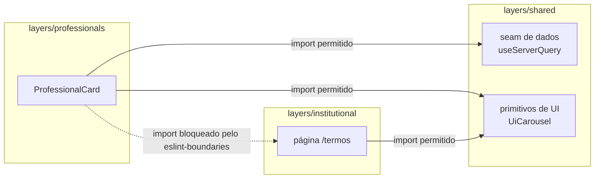

# Arquitetura: Nuxt Layers como modular monolith

Referência usada: [Nuxt Layers as a Modular Monolith](https://alexop.dev/posts/nuxt-layers-modular-monolith/).

## Por que modular monolith, e não um app Nuxt "flat"

O produto começou com um domínio principal (profissionais), mas cresceu pra incluir páginas institucionais, suporte e favoritos. Um app Nuxt "flat" (tudo em `components/`, `pages/`, `composables/` únicos) mistura esses domínios sem fronteira nenhuma — qualquer import cruzado passa despercebido até virar acoplamento difícil de desfazer.

Nuxt Layers dá isolamento de domínio **sem** o custo operacional de microserviços/multi-repo: cada domínio é uma pasta com seu próprio `app/` e `server/`, mas tudo builda e deploya junto, como uma aplicação só.

## Estrutura

```
layers/
  shared/         fundação: design tokens, layout (Header/Footer/BottomNav), seam de dados, primitivos de UI
  professionals/  domínio principal: catálogo, filtros, perfil, carrossel de fotos
  institutional/  páginas estáticas (termos, privacidade)
  support/        página de suporte
  favorites/      favoritos (empty-state, sem persistência ainda)
```

`extends` no `nuxt.config.ts` da raiz declara a ordem — `shared` sempre primeiro (fundação), depois as features. Novo domínio = nova pasta em `layers/` + uma linha em `extends`.

## Regra de dependência

`shared` não importa nada de fora. Qualquer feature layer só pode importar de `shared` — nunca de outra feature. Checado em CI via ESLint (`eslint-plugin-boundaries`, regra `boundaries/dependencies`): um import `professionals` → `institutional` falha o lint, não é só convenção documentada.



## Por que essa regra especificamente (e não feature→feature liberado)

Duas features nunca precisam se conhecer diretamente neste domínio — o catálogo de profissionais não depende de saber que a página de suporte existe, e vice-versa. Se um caso real pedisse compartilhar algo entre duas features, a resposta correta é promover pra `shared` (ver `CLAUDE.md` → regra de promoção só no 2º consumidor real), não abrir uma exceção pontual na regra de boundaries. Isso mantém `shared` como o único lugar onde "várias features dependem disso" é uma afirmação verificável, não uma suposição.

## Cada layer é uma fatia vertical completa

Dentro de `layers/<domínio>/`:
- `app/` — components, composables, pages, services, types (código de app, client+SSR)
- `server/api/*.get.ts` — rotas Nitro reais que servem os dados daquele domínio
- `mock/` — geração dos dados fictícios (Faker) + handlers MSW (só usados em teste)
- `e2e/` — specs Playwright dos fluxos daquele domínio

Um domínio novo não precisa tocar em nenhum outro layer pra existir — só precisa da entrada em `extends`.
