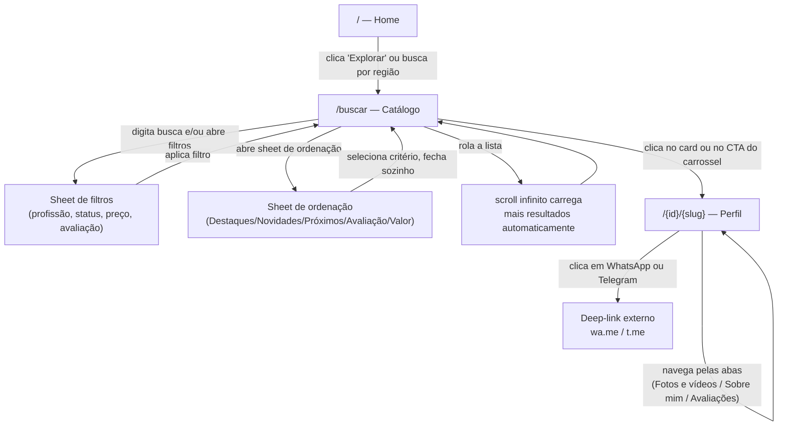
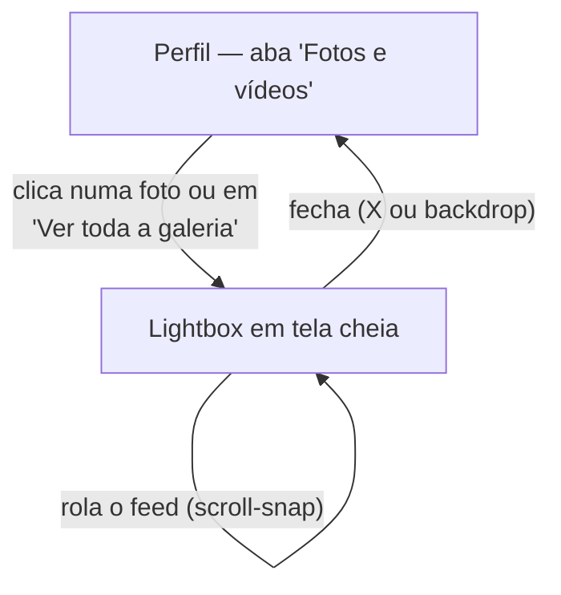
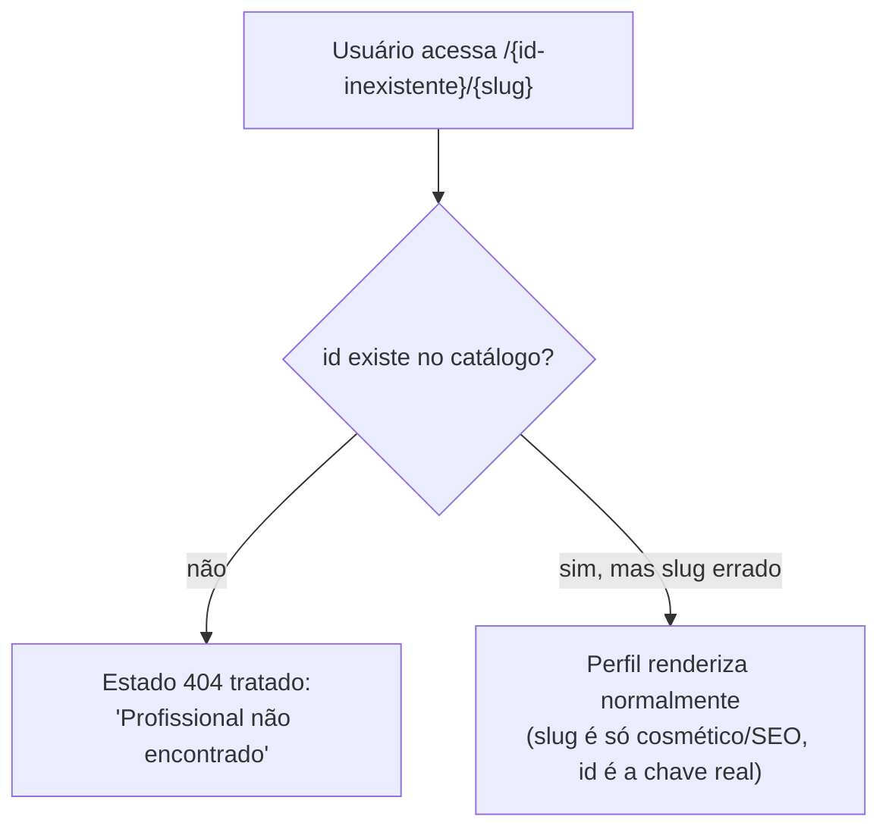

# Fluxos de usuário

Como o usuário se comporta na tela pra atingir um objetivo — passo a passo, ligado às telas/rotas reais do app.

## Fluxo principal: descobrir e contatar um profissional

**Objetivo do usuário:** encontrar um profissional que atenda um critério (profissão, preço, avaliação, proximidade) e iniciar contato.

**Pontos de decisão do usuário:**
- Confia na busca por texto (já sabe o que quer) → vai direto pro campo de busca.
- Não sabe exatamente o que quer → usa filtros/ordenação pra reduzir opções.
- Quer algo perto → usa "Próximos de mim" (geolocalização) em vez de digitar região.

**O que garante que o usuário não trava:**
- Scroll infinito elimina o passo de "clicar em carregar mais" — a barreira de continuar explorando é zero.
- Filtro e busca ficam sempre visíveis (toolbar sticky), mesmo rolando a lista — o usuário nunca precisa voltar ao topo pra ajustar o critério.
- Contato é 1 clique direto pro app externo (WhatsApp/Telegram) — sem formulário intermediário, sem cadastro.

## Fluxo secundário: explorar a galeria de um profissional

**Objetivo do usuário:** ver mais fotos/vídeos de um profissional específico antes de decidir.

**Por que grade e feed, não só um formato:** grade favorece varredura rápida (quero ver tudo de uma vez); feed favorece imersão (quero olhar uma foto de cada vez, tela cheia). O usuário escolhe conforme a intenção do momento.

## Fluxo de recuperação de erro: link de perfil inválido

**Objetivo do usuário:** entender o que aconteceu quando um link (compartilhado ou digitado errado) não corresponde a nenhum profissional real.

O slug no fim da URL nunca é validado — só o `id` importa pra buscar o profissional certo. Isso significa que um link com nome desatualizado (profissional trocou de nome) continua funcionando, só com a URL "desatualizada" na aparência.

## Navegação persistente (mobile)

A barra inferior (Explorar `/` · Buscar `/buscar` · Favoritos `/favoritos` · Chat) fica fixa em toda a navegação, exceto dentro do perfil de um profissional — lá ela dá lugar à barra fixa de contato (preço + CTA), porque nesse contexto a ação prioritária do usuário deixa de ser "trocar de área do app" e passa a ser "agir sobre este profissional".
